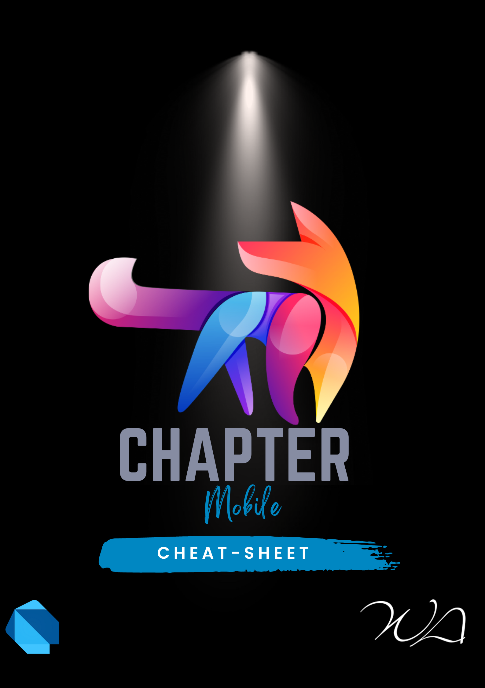

# Dart
<p align="center">
  <!-- <a href="https://docs.docker.com/" target="blank"> -->
  </a>
</p>


# Instalar dart
* Documentacion para instalar dart
* [Dart](https://dart.dev/get-dart)
* [Opcion alternativa](https://formulae.brew.sh/formula/dart-sdk)
```shell
   brew install dart-sdk
   unlink /opt/homebrew/bin/dart
   ln -s /opt/homebrew/bin/ ../Cellar/dart-sdk/3.0.1/bin/dart
   dart --version
```

---

# Dart Atajos.
* [Dart getting started docs](https://dart.dev/samples)
## Interpolación de Strings
```dart
    '${3 + 2}'               <== '5'
    ${"word".toUpperCase()}' <== 'WORD'
    '$myObject'              <== myObject.toString()
```

## Variables con posibilidad nula
```dart
    int a = int? ;  // NO-Valido en null-safe Dart.
    int? a = null;  // Valido en null-safe Dart
    int? a;         // El valor inicial de a es NULL.
```

## Operadores de valores nulos
```dart
    int? a;     // = null
    a ??= 3;
    print(a);   // <-- Imprime 3
    a ??= 5;
    print(a);   // <-- Aún imprime 3
    print(1 ?? 3);      // <-- Imprime 1.
    print(null ?? 12);  // <-- Imprime 12
```

## Acceso a propiedades opcionales
```dart
    myObject?.someProperty
    // Con ternario
    (myObject != null)
        ? myObject.someProperty
        : null;
    myObject?.someProperty?.someMethod();
```
## Tipos de colecciones
* 📔 Inferir tipo de forma automática
```dartdart
    final aListOfStrings = ['one', 'two', 'three'];
    final aSetOfStrings = {'one', 'two', 'three'};
    final aMapOfStringsToInts = {
        'one': 1,
        'two': 2,
    };
```
* 📔 Pero se puede especificar de manera manual
```dart
    final aListOfInts = <int>[];
    final aSetOfInts = <int>{};
    final aMapOfIntToDouble = <int, double>{};
```
* 📔 También aplica si aplicamos un lista de una clase base, los valores internos pueden ser de subclases.
```dart
    final aListOfBaseType =
    <BaseType>[SubType(), SubType()];
```

## Sintaxis de Flecha
* 📔 Es básicamente una función que inmediatamente retorna un valor.
```dart
    /// Función normal
    bool hasEmpty = aListOfStrings.any((s){
        return s.isEmpty;
    });

    /// Función de flecha
    bool hasEmpty = aListOfStrings.any((s) => s.isEmpty);
```

## Cascades
```dart
    /// Sin cascadas
    myObject.someMethod();
    myObject.someOtherMethod();

    /// Con cascadas
    myObject
        ..someMethod()
        ..someOtherMethod()

    /// Se puede con propiedades
    var button = querySelector('#confirm');
    button?.text = 'Confirm';
    button?.classes.add('important');
    button?.onClick.listen((e) =>
    window.alert('Confirmed!'));
    button?.scrollIntoView();
    querySelector('#confirm')
        ?..text = 'Confirm'
        ..classes.add('important')
        ..onClick.listen((e) => window.alert('Confirmed!'))
        ..scrollIntoView();
```

## Getters y Setters
* 📔 Los guiones bajos en Dart, son indicadores de métodos y propiedades privadas de clase y módulo.
```dart
    class MyClass {
        int _aProperty = 0;
        int get aProperty => _aProperty;
        set aProperty(int value) {
            if (value >= 0) {
                _aProperty = value;
            } 
        }
    }
```
* 📔 También se puede usar los getters para definir una propiedad computada.
```dart
    class MyClass {
        final List<int> _values = [];
        void addValue(int value) {
            _values.add(value); 
        }

        // A computed property.
        int get count {
            return _values.length;    
        } 
    }
```

## Funciones, métodos y argumentos
* 📔 Obligatorios
```dart
    int sumUp(int a, int b, int c) {
        return a + b + c;
    }
    // ...
    int total = sumUp(1, 2, 3);
```
* 📔 Opcionales
```dart
    int sumUpToFive(int a, [int? b, int? c, int? d, int? e]){
        int sum = a;
        if (b != null) sum += b;
        if (c != null) sum += c;
        if (d != null) sum += d;
        if (e != null) sum += e;
        return sum;
    }   
    // ··· 
    int total = sumUpToFive(1, 2);
    int otherTotal = sumUpToFive(1, 2, 3, 4, 5);
```

* 📔 Parámetros con nombre Los parámetros con nombre son siempre opcionales a menos que estén marcados con la palabra reservada require
```dart
    void printName(String firstName, String lastName,
        {String? middleName }) {
        print('$firstName ${middleName ?? ''} $lastName'); 
    }
    // ···
    printName('Dash', 'Dartisan');
    printName('John', 'Smith', middleName: 'Who');
    // Los parámetros con nombre pueden ser
    colocados en cualquier parte
    printName('John', middleName: 'Who', 'Smith');
```
* 📔 Si un valor opcional quiere ser manejado sin operadores de valores nulos, se puede establecer un valor por defecto

```dart
    void printName(){
        String middleName
        print('$middleName');
    }
```
## Excepciones
```dart
    throw Exception(‘OOOPS!!!.’);
    throw 'Waaaaaaah!';
```
* 📔 Se puede usar try, on y catch para manejarlas
```dart
try {
    breedMoreLlamas();
} on OutOfLlamasException {
    // Una excepción específica
    buyMoreLlamas();
} on Exception catch (e) {
    // Cualquier excepción
    print('Unknown exception: $e');
} catch (e) {
    // No especificado, maneja cualquiera
    print('Something really unknown: $e’);
}
```
* 📔 Si no se puede manejar en su totalidad, se puede propagar la excepción al padre
```dart
    try {
        breedMoreLlamas();
    } catch (e) {
        print('I was just trying to breed llamas!');
        rethrow
    };
```
* 📔 Después de ejecutar un try, catch, u on, si está especificado el finally, se ejecutará.
```dart
    try {
        breedMoreLlamas();
    } catch (e) {
        // ... manejar la excepción ...
    } finally {
        // Siempre hacer una limpieza si lo amerita
        cleanLlamaStalls();
    }
```

## Operador this
* 📔 Usar el operador this en Dart, en muchos lugares es
opcional y en otros obligatorio, la mejor forma de dominar esto es practicando.
* En el constructor para asignación de propiedades
```dart
    class MyColor {
        int red;
        int green;
        int blue;
        MyColor(this.red, this.green, this.blue);
    }
    final color = MyColor(80, 80, 128)
```
* 📔 Esta técnica también funciona para parámetros con nombre, propiedades se vuelven los nombres de los parámetros.
```dart
    class MyColor {
    ...
        MyColor({
            required this.red,
            required this.green,
            required this.blue
        )};
    }
    final color = MyColor(red: 80, green: 80, blue: 80);
```

## Listas de inicialización
```dart
    Point.fromJson(Map<String, double> json)
        : x = json['x']!,y = json['y']! {
            print('In Point.fromJson(): ($x, $y)');
        }
```

* 📔 Adicionalmente que se pueden colocar aserciones y reglas para que en desarrollo se cumplan las normas establecidas.
```dart
    NonNegativePoint(this.x, this.y)
        : assert(x >= 0),assert(y >= 0) {
        print(‘Punto no negativo: ($x, $y)');
    }    
```

## Constructores con nombre
* 📔 Esto permite a las clases tener múltiples constructores.
```dart
    class Point {
        double x, y;
        Point(this.x, this.y);
        Point.origin(): x = 0, y = 0;
    }
    ...
    final myPoint = Point.origin();
```

## Constructores Factory
```dart
    class Square extends Shape {}

    class Circle extends Shape {}

    class Shape {
        Shape();
        factory Shape.fromTypeName(String typeName) {
            if (typeName == 'square') return Square();
            if (typeName == 'circle') return Circle();
                throw ArgumentError('Unrecognized $typeName');
        } 
    }
```

## Redireccionando constructores
* 📔 A veces, el único propósito del constructor es redireccionar a otro constructor
```dart
    class Automobile { 
        String make; String model; int mpg;
        // Constructor principal de la clase
        Automobile(this.make, this.model, this.mpg);
        // Delega al constructor principal
        Automobile.hybrid(String make, String model) : this(make, model, 60);
        // Deleta al constructor con nombre
        Automobile.fancyHybrid() : this.hybrid('Futurecar', 'Mark 2');
    }
```

## Constructores constantes
* 📔 Si la clase produce objetos que nunca cambiarán, puedes crear esos objetos como constantes de tiempo de compilación y asegurarte que todas las instancias serán finales (finals).
```dart
    class ImmutablePoint {
        static const ImmutablePoint origin =
        ImmutablePoint(0, 0);
        final int x;
        final int y;
        const ImmutablePoint(this.x, this.y);
    }
```

## Estructuras de Colecciones
### Listas
* 📔 Es una colección de objetos con un largo e indice
```dart
    final listOfNumbers = [1, 2, 3];
    final vehicles = ['Car','Boat','Plane'];
    var constantList = const [1, 2, 3];
// constantList[1] = 1;
// Esa línea dará error porque es constante
```
* 📔 Operador spread ( ... )
```dart
    final list = [1, 2, 3];
    final list2 = [0, ...list];
    // 0,1,2,3
```

* 📔 Spread con null-aware operator ( ...? ), en caso de que la lista pueda ser nula
```dart 
    final list2 = [0, ...?list];
```
* 📔 En Dart es posible colocar if y for dentro de la creación de la lista.

```dart
    var nav = ['Home', 'Furniture','Plants', if (promoActive) 'Outlet'];

    var listOfInts = [1, 2, 3];
    var listOfStrings = [ 
        '#0', for (var i in listOfInts)
        '#$i'
    ];
```
## Sets
* 📔 Un set es una colección no ordenada de elementos únicos.
```dart
    var halogens = {
        'fluorine',
        'chlorine', 
        'bromine', 
        'iodine',
        'astatine'
    };

    Set<String> halogens = {
        'fluorine',
        'chlorine', 
        'bromine', 
        'iodine',
        'astatine'
    };

    var names = <String>{};
```
* Métodos comunes de los Sets
```dart
    var elements = <String>{};
    elements.add('fluorine');
    elements.addAll(halogens);
    elements.length; // 5 (ya existía)
    
    final constantSet = const {
        'fluorine',
        'chlorine',
        'bromine',
        'iodine',
        'astatine',
    };
// constantSet.add('helium'); // Error, porque es constante
```
## Maps
* 📔 Es un objeto que asocia pares de valores, (key-value pairs), las llaves y valores pueden ser de cualquier tipo de dato.
```dart
    var gifts = {
        // Key: Value
        'first': 'partridge',
        'second': 'turtledoves',
    };
    var nobleGases = {
        2: 'helium',
        10: 'neon',
        18: 'argon',
    };
```
* 📔 Puedes usar el constructor de mapas y genéricos para establecer su apariencia.

```dart
    var gifts = Map<String, String>();
    gifts['first'] = 'partridge';
    gifts['second'] = 'turtledoves';
    gifts['fifth'] = 'golden rings';
    var nobleGases = Map<int, String>();
    nobleGases[2] = 'helium';
    nobleGases[10] = 'neon';
    nobleGases[18] = 'argon';
```
* Determinar el largo del map
```dart
    var gifts = {'first': 'partridge'};
    gifts['fourth'] = 'calling birds';
    gifts.length; // 2
    final constantMap = const {
        10: 'neon',
        18: 'argon',
     };
    
    // constantMap[2] = 'Helium';
    // Error debido a que es constante
```
## Iterable
* 📔 La diferencia con una lista, es que con el iterable, tu no puedes garantizar que leer elementos con indice será eficiente
```dart
    Iterable<int> iterable = [1, 2, 3];
    iterable[1]; // NO HACER
    
    // Usar esto
    int value = iterable.elementAt(1);
```
* 📔 Los iterables tienen su propio set de métodos que permiten barrer y controlarlo.
```dart
    String element =
    iterable.firstWhere(
        (element) => element.length > 5
    );
    |-------------------------------------------------------------------|
    | Descripcion     | Operador                 | Asociatividad        |
    |-----------------|--------------------------|----------------------|
    |Postfijo         | expr++ expr-- () [] ?    | None                 |
    |unitario         | [] . ?. !                |                      |
    |-----------------|--------------------------|----------------------|
    |Prefijo unitario | -expr !expr ~expr +      | None                 |
    |                 | +expr --expr await expr  |                      |
    |-----------------|--------------------------|----------------------|
    |Multiplicativo   | * / % ~ /                | Left                 |
    |-----------------|--------------------------|----------------------|
    |Aditivo          | + -                      | Left                 |
    |-----------------|--------------------------|----------------------|
    |Shift            | << >> >>>                | Left                 |
    |-----------------|--------------------------|----------------------|
    |bitwise AND      | &                        | Left                 |
    |-----------------|--------------------------|----------------------|
    |bitwise XOR      | ^                        | Left                 |
    |-----------------|--------------------------|----------------------|
    |bitwise OR       | |                        | Left                 |
    |-----------------|--------------------------|----------------------|
    |Relacional y     | >= > <= < as is is!      | None                 |  
    |tipo de dato     |                          |                      |
    |-----------------|--------------------------|----------------------|
    |Equidad          | == !=                    | Left                 |
    |-----------------|--------------------------|----------------------|
    |AND Lógico       | &&                       | Left                 |
    |-----------------|--------------------------|----------------------|
    |OR Lógico        | ||                       | Left                 |
    |-----------------|--------------------------|----------------------|
    |if null          | ??                       | Left                 |
    |-----------------|--------------------------|----------------------|
    |conditional      | expr1 ? expr2 : expr3    | Right                |
    |-----------------|--------------------------|----------------------|
    |cascade          | .. ?..                   | Left                 |
    |-----------------|--------------------------|----------------------|
    |assignment       | = *= /= += -= &= ^= etc. | Right                |
    |-----------------|--------------------------|----------------------|
```
# Programación Asíncrona
* 📔 Principalmente cuando hablamos de programación asíncrona estaremos nos referiremos a funciones, métodos u objetos que retornan Futures y Streams.
* 📔 Tareas comunes asíncronas
    1. Leer data sobre internet.
    2. Escribir sobre base de datos.
    3. Leer y/o escribir un archivo.
## Estados del Future:
```dart
    |------------------------------------------------------------------|
    | Estado       | Descripcion                                       |
    |--------------|---------------------------------------------------|
    |Uncompleted   |Ejecutando el Future y esperando un resultado.     |
    |--------------|---------------------------------------------------|
    |Completed     |El resultado del Future fue exitoso.               |
    |--------------|---------------------------------------------------|
    |Completing    |Donde el value, es el valor especificado por el    | 
    |witha value   |Future, si no hay nada definido, será dynamic.     |
    |--------------|---------------------------------------------------|
    |Completing    |El Futuro falló, y es disparada la clausula catch  |
    |with an error |                                                   |
    |------------------------------------------------------------------|
```
* 📔 Si el Future es exitoso, se ejecuta el THEN y si falla, el CATCH es disparado.
```dart
    myFunc()
        .then(processValue)
        .catchError(handleError);
```
## Async - Await
* 📔 La palabra async es usada para transformar una función o método en un Future, en pocas palabras es una forma corta de convertir la función tradicional en una función asíncrona.
```dart
    void main() async { ··· }
    // Equivalente a:
    Future<void> main() async { ··· }
```
* 📔 La palabra await, es usada para esperar el resultado de un Future como si fuera una tarea síncrona.
```dart
    print(await createOrderMessage());
```
* 📔 La palabra await siempre debe de ser usada dentro de funciones asíncronas, si no, no podrá ser usada.
```dart
    Future<String> createOrderMessage() async {
        var order = await fetchUserOrder();
        return 'Your order is: $order';
    }
```
## Streams
* 📔 Los Streams proporcionan una secuencia asíncrona de datos.
* 📔 Las secuencias de datos incluyen eventos generados por el usuario y lectura de datos de archivos.
* 📔 Puede procesar una transmisión usando await o listen( ) desde el Stream API.
* 📔 Los Streams proporcionan una forma de responder a los errores.
* 📔 Hay dos tipos de transmisiones:
* 📔 Suscripción única
* 📔 Broadcast (múltiples listeners)
## Async* y Yield
* 📔 Así como el async, transforma una función o método en una función asíncrona que regresa un Future, el async* transforma el retorno a un stream, y en lugar de un return, se usa yield para emitir un valor del Stream. (El await puede ser usado dentro de async*)
```dart
    Stream<String> lines(Stream<String> source)
    async* {
        var partial = '';
        // Esperar el resultado del Stream Source
        await for (final chunk in source) {
            // Añadir valores a quien escuche el stream
            yield line;
        }
        // Añadir una última emisión
        if (partial.isNotEmpty) yield partial; 
    }
```
## Stream transformations
- 📔 Son métodos que ya vienen incluídos en los streams y permiten transformar las emisiones.
* 📔 Las transformaciones más comunes son:
```dart 
    map(), where(), expand(), y take()

    var counterStream = Stream<int>.periodic(
        const Duration(seconds: 1),
        (x) => x)
        .take(15);
```
* Otros ejemplos:
```dart
    // Filtrar emisiones
    .where((int x) => x.isEven)
    
    // Duplicar cada emisión
    .expand((var x) => [x, x])

    // Se detiene a las 5 emisiones
    .take(5)
```
* Más sobre Futures y Streams:
[Programación asíncrona, futures, async, await - Dart.dev Creando Streams - Dart.dev](https://dart.dev/codelabs/async-await)

# Glosario de términos
## Null-safe
* 📔 Es un estándar hoy en día que se use la versión de Dart que ayuda a determinar si una variable puede ser nula o no.

## Sound Null Safety - Null Safety
- 📔 Esto es una combinación entre Flutter y Dart, que dice que tu aplicación tiene la verificación de nulos activada.

## Const - Constantes
- 📔 Es un espacio en memoria que aloja un valor que nocambiará desde su momento de compilación (Build time de la aplicación final)

## Final - Variables finales
- 📔 Se asigna un valor (en tiempo de ejecución), y ese valor no cambiará desde esa primera asignación;

## Late - Inicialización tardía
- 📔 Es conocido como inicialización tardía, en otras palabras, late permite decirle a Dart que esa variable tendrá un valor al momento de usarse, es responsabilidad del desarrollador asegurar que eso se cumpla

## Void
- 📔 Void es una palabra reservada para indicar que el método o función no retornará ningún valor, cualquier intento de retorno marcará error.

## Iterable
- 📔 Es una colección de elementos que se puede leer de manera secuencial.
Es un objeto que puede contar elementos que se encuentren dentro de él, como listas, sets, arreglos, etc.

## Future
- 📔 Un Future representa principalmente el resultado de una operación asíncrona. Es una promesa de que pronto tendrás un valor. La promesa puede falla y hay que manejar la excepción. Los futures son un acuerdo de que en el futuro tendrás un valor para ser usado.

## Streams
- 📔 Los streams pueden ser retornados y usados como objetos, funciones o métodos, son un flujo de información que puede estar emitiendo valores periódicamente, una única vez, o nunca.

- 📔 Un Stream podría verse como una manguera conectada a un tubo de agua, cuando abres el tubo el agua fluye, cada gota de agua sería una emisión del Stream, la manguera puede nunca cerrarse, cerrarse o nunca abrirse.

## Librería - Library
- 📔 Le permiten dividir algún fragmento de código o módulo en varios archivos y compartirlos con otros desarrolladores

- 📔 Otro beneficio de las bibliotecas, además de la estructuración del código, es que permiten la encapsulación de bibliotecas (determinar qué es visible o no para otras bibliotecas). Ejemplo: ```dart import 'dart:math' show Point;```

## Paquetes - Packages
- 📔 Cada proyecto Dart tiene un paquete Dart correspondiente.
- 📔 El principal beneficio de trabajar con paquetes es que el código que contienen se puede reutilizar y compartir. El envío y extracción de dependencias al sitio web pub.dartlang.org y al repositorio se realiza mediante la herramienta pub.
- 📔 En Dart, hay dos tipos de packages: Application Packages y Library Packages.

## PUB
* Pub es el administrador de paquetes para el lenguaje de programación Dart, que contiene bibliotecas y paquetes reutilizables para Flutter y programas generales de Dart.

## Dart
- 📔 Dart es un lenguaje de programación de desarrollo
optimizado para el cliente, de código abierto y orientado a objetos. Tiene sintaxis de estilo C. Se utiliza para crear una interfaz de usuario atractiva para dispositivos móviles y la web. Es la base de Flutter.
